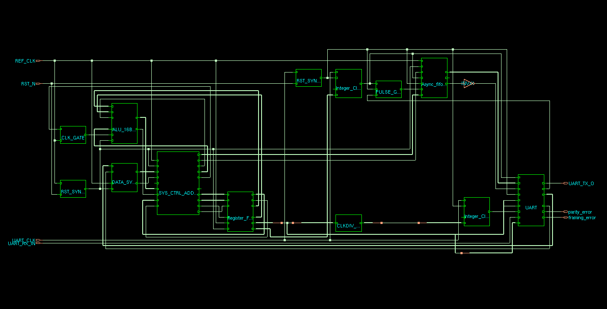

# RTL-to-GDS Flow: Synthesis with Cadence Genus

Welcome to the Synthesis phase of the ASIC design flow! This directory contains everything you need to translate your high-level RTL (Verilog/SystemVerilog) into a mapped, gate-level netlist using the **Cadence Genus Synthesis Solution**. 

This guide is designed for beginners. It will walk you through how to execute the flow, what the script does under the hood, the files it generates, and how to visualize your synthesized hardware.

---

## 🚀 1. How to Run the Script

To execute the synthesis flow, you need to launch the Cadence Genus tool and pass the synthesis script to it. 

Open your Linux terminal, navigate to this directory, and run the following command:

```bash
# Run Genus in batch mode with the synthesis script
genus -files synth.tcl
```

*Alternatively, if you want to run it interactively (to type commands one by one):*
```bash
# 1. Launch the tool
genus
# 2. Inside the Genus prompt, source the script
genus@root:> source synth.tcl
```

---

## 📜 2. Script Explanation (`synth.tcl`)

The `synth.tcl` script automates the synthesis process. Here is a beginner-friendly breakdown of what happens step-by-step when you run it:

### Step 1: Setup & Initialization
The script starts by defining the environment. It sets the design name (`TOP`), points to where the RTL and Constraints are located, and specifies the **Standard Cell Library** (`slow.lib`) that defines the physical gates (AND, OR, Flip-Flops) the tool is allowed to use. It also creates organized output folders (`Netlist` and `Report`).

### Step 2: Read RTL & Elaboration
```tcl
read_hdl -sv [glob "$HDL_PATH/*.sv"] 
elaborate $DESIGN_NAME -parameters {8 4 16 2048 11}
```
* **Reading:** Loads your Verilog code into the tool's memory.
* **Elaboration:** The tool builds a mathematical model of your design. We use `-parameters` to dynamically override the default design sizes (e.g., expanding the FIFO to 2048 depth and modifying the Address width to 4).

### Step 3: Generic Synthesis (`syn_generic`)
The tool converts your RTL into "GTECH" (Generic Technology) gates. These aren't real physical gates yet—they are an intermediate logic representation to simplify the math.

### Step 4: Constraints & Linting
```tcl
source cons.tcl
check_timing_intent -verbose > $REPORT_DIR/..._timing_lint.rpt
```
The script reads `cons.tcl`, which tells the tool your target clock speeds (e.g., 50MHz), input/output delays, and load capacitances. `check_timing_intent` acts as a "spell-checker" for your timing rules to make sure nothing was missed before the heavy lifting begins.

### Step 5: Technology Mapping & Optimization (`syn_map` & `syn_opt`)
This is the core of synthesis! The tool replaces the generic math gates with actual physical gates from `slow.lib`. It then aggressively optimizes the design (`syn_opt`) to make sure it meets your clock speeds without using too much area or power.

### Step 6: Exporting Outputs
Finally, the script exports the finished gate-level netlist (`.v` file) and the timing constraints (`.sdc` file) so they can be passed to the next stage: **Physical Design / Place and Route (Innovus)**.

---

## 📂 3. Expected Output

Once the script finishes successfully, a new directory named **`TOP_Synth`** will be created. Inside, you will find two sub-directories:

### `/Netlist` (Your Deliverables for Place & Route)
* **`TOP_Netlist.v`**: The final synthesized gate-level Verilog. If you open this, you won't see your original code; you'll see thousands of interconnected logic gates.
* **`TOP_mapped.sdc`**: The Synopsys Design Constraints file, which passes your timing rules down to the physical layout tool.
* **`TOP_GTECH_Netlist.v`**: An intermediate generic netlist (mostly for debugging).

### `/Report` (Your Synthesis Results)
This folder contains detailed text files evaluating the quality of your synthesized design. 

**Timing Reports ⏱️**
* **`TOP_timing_worst_path.rpt`**: Check this file first! It provides a deep dive into the *single slowest logic path* in your design. If the "Slack" at the bottom is positive, you successfully met your target clock speed.
* **`TOP_timing_worst_negative.rpt`**: If your design fails timing, this file lists the top 10 worst paths. It helps you see if the failure is isolated to one module or widespread.
* **`TOP_timing_lint.rpt`**: A "spell-checker" for your constraints. It flags unconstrained inputs/outputs, unclocked flip-flops, or missing timing rules that could cause silicon failures.
* **`TOP_clocks.rpt`**: Confirms how the tool interpreted your clock constraints, showing the active clock networks, frequencies, and periods.

**Area & Gate Reports 📐**
* **`TOP_area_summary.rpt`**: Displays the total estimated silicon area required for your design (measured in square micrometers or equivalent gate counts).
* **`TOP_area_hierarchical.rpt`**: Breaks down the area usage module-by-module. This is perfect for identifying which specific block (e.g., the FIFO or the ALU) is taking up the most space on the chip.
* **`TOP_gates_count.rpt`**: A detailed inventory listing the exact count of every physical gate type used from the standard cell library (e.g., how many NAND gates, how many Flip-Flops).

**Power, Hierarchy & Summary Reports ⚡**
* **`TOP_power_summary.rpt`**: Estimates the power consumption of your chip, broken down into dynamic power (switching/internal) and static power (leakage).
* **`TOP_hierarchy.rpt`**: Shows the structural tree of your design (parent modules and child sub-modules) as the synthesizer mapped it.
* **`TOP_qor.rpt`**: **Quality of Results (QoR)**. This is the ultimate "executive summary" report combining the most critical metrics into one file: worst timing slack, total area, total cell count, and how long the tool took to run.
---
---

## 👁️ 4. How to View the Schematic

Visualizing the gate-level schematic is a great way to understand how the tool implemented your Verilog code. 


### Interactive View (Using Genus GUI)
To interactively explore the schematic (zoom in, trace paths, highlight specific gates):
1. Run Genus interactively and source the script:
   ```bash
   genus
   genus@root:> source synth.tcl
   ```
2. Once the script finishes, launch the graphical interface:
   ```tcl
   genus@root:> gui_show
   ```
3. A new window will pop up. 
4. In the top toolbar, click on the **Schematic** icon (it looks like a logic gate), or right-click your design name in the hierarchy browser and select **Schematic View**.
5. You can now double-click on blocks to dive deeper into the hierarchy and see exactly how the tool connected your logic!

This is a pre-generated snapshot of the synthesized schematic layout.
